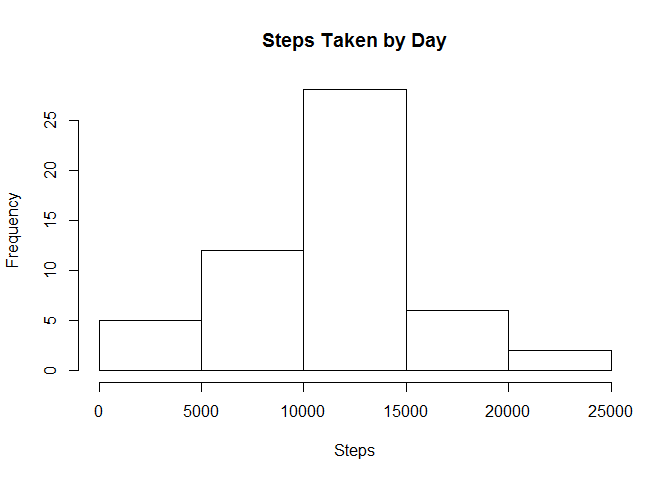
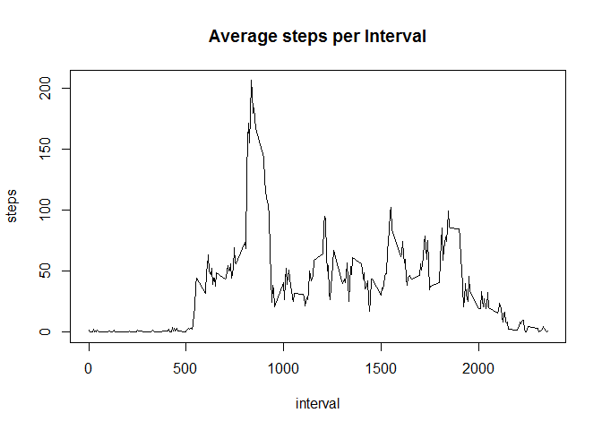
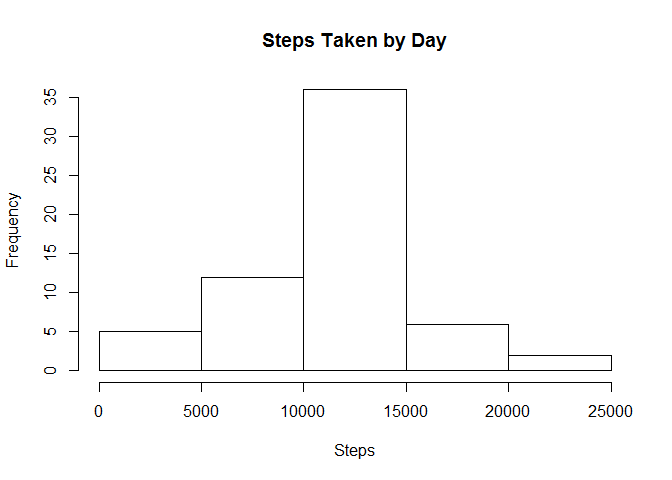

# Reproducible Research: Peer Assessment 1


###Loading and Preprocessing The Data
The "activity.csv" file is loaded into a Dataframe.

```r
activity <- read.csv("activity.csv")
activity$date <- as.Date(activity$date)
```


###What is the mean total steps taken per day?
First I create a new Dataframe that groups the original by day (using the dplyr package). I then summarize the daily data by total number of steps taken. (Note: I have purposefully not shown the messages from loading the dplyr package for readability.)


```r
activityDays <- group_by(activity,date) %>% summarize(steps = sum(steps))
```
To explore this daily data, a histogram is created. \n  

```r
hist(activityDays$steps, xlab="Steps", main="Steps Taken by Day")
```



To further explore the data, here are the mean and median number of steps taken in a day.

```r
mean(activityDays$steps, na.rm=T)
```

```
## [1] 10766.19
```

```r
median(activityDays$steps, na.rm=T)
```

```
## [1] 10765
```


###What is the daily average activity pattern?
First I'll create a new Dataframe grouped by each day's five-minute intervals.

```r
activityIntervals <- group_by(activity,interval) %>% summarize(steps = mean(steps, na.rm=T))
```
Now let's plot the interval means as a time-series graph.

```r
with(activityIntervals,plot(interval,steps,type="l",main="Average steps per Interval"))
```



Now it appears that the highest average interval for steps appears at around the 800 minute mark during the day.  
With this R command we can find the exact interval.

```r
activityIntervals[which.max(activityIntervals$steps),]
```

```
## Source: local data frame [1 x 2]
## 
##   interval    steps
##      (int)    (dbl)
## 1      835 206.1698
```


###Inputting Missing Values
There are many NA values for steps in the original Dataframe. In fact this can be calculated.

```r
sum(is.na(activity$steps))
```

```
## [1] 2304
```
To replace the many NA values for steps during an interval, I feel a reasonable approach would be to replace the missing values with the mean for that interval

```r
activityNoNA <- group_by(activity,interval) %>% mutate(steps= replace(steps, is.na(steps), mean(steps, na.rm=TRUE)))
```

Let's compare the daily data in this new Dataframe with the original.

```r
activityDaysNoNA <- group_by(activityNoNA,date) %>% summarize(steps = sum(steps))
hist(activityDaysNoNA$steps, xlab="Steps", main="Steps Taken by Day")
```



And here are the mean and median for this new Dataframe.

```r
mean(activityDaysNoNA$steps, na.rm=T)
```

```
## [1] 10766.19
```

```r
median(activityDaysNoNA$steps, na.rm=T)
```

```
## [1] 10766.19
```
This method of replacing the NA values has very little effect on the mean and median values as compared to the original data. In fact the mean is the same (understandably) and the median is now the same as the mean (due to entire missing days of data).


###Are there differences in activity patterns between weekdays and week-ends?
To perform this analysis I'll create a new variable in the activityDays Dataframe indicating whether that particular date is a Saturday or Sunday (weekend=TRUE) or not (weekend=FALSE).

```r
activity$weekend <- ifelse(weekdays(activity$date,abbreviate=T) == "Sat" | weekdays(activity$date,abbreviate=T) == "Sun",T,F)
```
Then I'll subset the Dataframe by this logical value and summarize it to find the mean steps per interval.

```r
weekendActivity <- subset(activity,weekend)
weekendActivity <- group_by(weekendActivity,interval) %>% summarize(steps = mean(steps, na.rm=T))
weekdayActivity <- subset(activity,!weekend)
weekdayActivity <- group_by(weekdayActivity,interval) %>% summarize(steps = mean(steps, na.rm=T))
```

Now I'll plot these two subsets of the data on top of each other to see if there is a difference.

```r
par(mfcol=c(2,1))
with(weekendActivity,plot(interval,steps,type="l",main="Weekend"))
with(weekdayActivity,plot(interval,steps,type="l",main="Weekday"))
```


There is a clearly a marked difference in the patterns between steps on weekdays and the weekend. The weekday is very structured, with a large amount of steps early in the day, and a reduced number later in the day. Whereas the weekend is much less structured, with larger amounts of walking at different times of the day.
